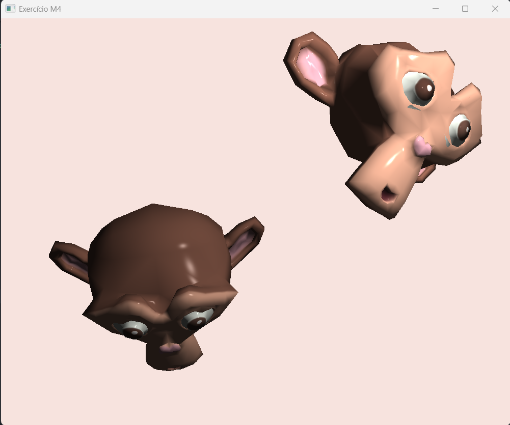

# Exercício do Módulo 4 - Iluminação (Modelo de Phong)

Trabalho da disciplina de Computação Gráfica (Unisinos).

Dando continuidade ao visualizador, agora os modelos são iluminados pelo
modelo de Phong. O programa lê os vetores normais do arquivo `.OBJ`, lê os
coeficientes de iluminação do arquivo `.MTL` e calcula, no fragment shader,
as parcelas ambiente, difusa e especular de cada pixel.



## O que foi implementado neste módulo

- Leitura dos vetores normais (linhas `vn`) do arquivo `.OBJ`
- Leitura do terceiro índice das faces (`v/vt/vn`), que diz qual normal
  pertence a cada vértice
- Buffer de vértices reorganizado: cada vértice agora guarda
  `x, y, z, s, t, nx, ny, nz`, com a normal como atributo 2 do VAO
- Leitura dos coeficientes `Ka`, `Kd`, `Ks` e `Ns` do arquivo `.MTL`,
  agrupados numa `struct Material` junto com o nome da textura
- Cálculo das três parcelas do modelo de Phong no fragment shader, com
  uma fonte de luz pontual

A textura faz o papel da cor do objeto: ela é multiplicada pelas parcelas
ambiente e difusa. A especular fica de fora, porque o brilho tem a cor da
luz, não a do material.

## Detalhes que valem a explicação

**A matriz normal.** O material de apoio transforma a normal com
`model * vec4(normal, 1.0)`. Com `w = 1`, a translação é somada à normal,
e a iluminação mudaria ao mover o objeto. Além disso, a escala não uniforme
entorta as normais. Usamos a matriz normal, que resolve os dois casos:

```glsl
scaledNormal = mat3(transpose(inverse(model))) * normal;
```

**A intensidade da luz ambiente (`Ia`).** O `Suzanne.mtl` traz `Ka = 1`.
Com `ambient = ka * lightColor`, só a parcela ambiente já daria a cor cheia
da textura, e a Suzanne ficaria sem sombreamento. Seguindo a equação
`I = Ia·ka + ...`, separamos a intensidade da luz ambiente (propriedade da
cena, `Ia = 0.2`) do coeficiente do material (`ka`, lido do arquivo).

**Valores padrão do material.** O `Suzanne.mtl` não tem linha `Kd`. A
`struct Material` já nasce com valores padrão, então o `kd` fica `1.0`
quando o arquivo não o define. Nesse modelo, a cor difusa vem da textura.

**O expoente especular.** O `Ns` do arquivo (233) é o `q` da equação.
Valores altos geram um brilho pequeno e concentrado (plástico, verniz);
valores baixos, um brilho grande e espalhado (superfície fosca).

## Limitações

O modelo de Phong é de iluminação local: cada ponto é calculado isolado,
olhando só sua normal, a luz e a câmera. Por isso não há sombras projetadas
nem luz rebatendo entre superfícies. Também não implementamos o fator de
atenuação (`fatt`), então a distância até a luz não altera a intensidade,
apenas o ângulo.

## Mantido dos módulos anteriores

Dois objetos na cena, seleção por teclado, transformações (rotação,
translação e escala) e texturas lidas a partir do `.MTL`. O objeto não
selecionado aparece escurecido.

## Como compilar e rodar

Precisa de CMake e um compilador C++. Usamos o MSYS2 com o VS Code no Windows.
O CMake baixa a GLFW, a GLM e a stb_image sozinho.

```bash
git clone <link-do-repositorio>
cd <pasta-do-projeto>
cmake -S . -B build
cmake --build build
```

Para rodar, entre na pasta `build` (senão o programa não acha os modelos):

```bash
cd build
./Exercicio_M4        # no Windows: .\Exercicio_M4.exe
```

Os arquivos do modelo ficam em `assets/Modelos3D/` e precisam estar juntos:
`Suzanne.obj`, `Suzanne.mtl` e `Suzanne.png`.

## Controles

| Tecla        | O que faz                                  |
| ------------ | ------------------------------------------ |
| TAB          | alterna o objeto selecionado               |
| R / T / S    | modo rotação / translação / escala         |
| X / Y / Z    | aplica a transformação no eixo escolhido   |
| Shift + eixo | inverte o sentido                          |
| U            | liga/desliga a escala uniforme             |
| Setas        | translada nos eixos X e Y                  |
| Espaço       | volta a cena para o estado inicial         |
| P            | alterna entre malha preenchida e wireframe |
| ESC          | fecha o programa                           |

O modo começa em translação. O modo escolhido e o objeto selecionado aparecem
no console.

## Referências

- Código base do leitor de OBJ e do `loadTexture`: repositório da disciplina
- [stb_image](https://github.com/nothings/stb)
- Material de apoio do Módulo 4 (Iluminação e implementação de Phong em GLSL)

---

Alunas: Eduarda Fernandes e Maria Eduarda Dias
